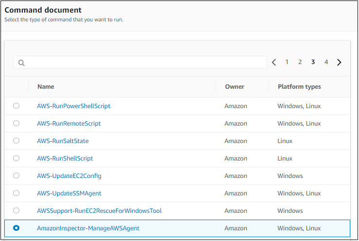
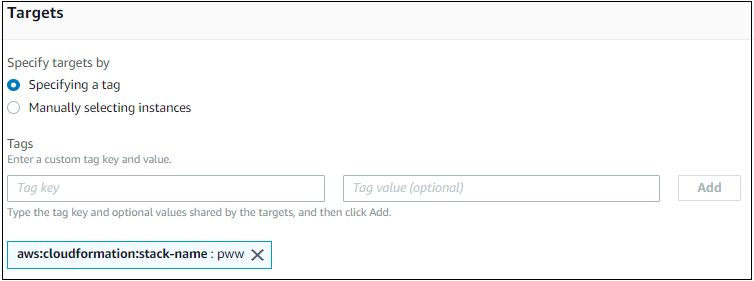

# Protecting Your Workloads - Assess Phase

In the previous Build Phase, you built a CloudFormation stack that contains
some Amazon EC2 instances behind an application load balancer.
You are now going to use Amazon Inspector to assess the instances and identify
findings that need to be remediated.

Before you can assess the instances with Amazon Inspector, you need to identify
the instances and install the Amazon Inspector agent on them.
This is easier to do in small environments but the task can becone much more
complex in organizations with hundreds or even thousands of instances.
For this reason, you are going to learn how to use *tags* to select the instances.
Tags are labels that can be attached to AWS resources to make it easier to
act on them collectively.

In this section you will do the following tasks:

1. Examine the stack you built
2. Look up the Amazon EC2 instances that were created as a result of the deployhment and understand the tags that are applied by AWS CloudFormation.
3. Use AWS Systems Manager to install the Amazon Inspector agent on the instances
4. Use Amazon Inspector to scan the instances

## Examine the stack that you built

1. Go to the CloudFormation console in the same AWS region in which you created the stack in the Build Phase.  You should see a list of stacks similar to the figure below. Locate the stack you created.  In this documentation, the name of the stack is *pww*.  Copy this stack name into a scratch file on your workstation in case you need it later.

    

2. Click the **check box** to the left of the stack name and then click the **Resources** tab below.  You will see a list of resources that were deployed by the stack as shown in the figure below.

    

    The *Type* column lists the type of the resouces.  Notice that you will not see any resources of type AWS::EC2::Instance.  The reason for this is that the CloudFormation stack did not deploy any.  The stack did, however, deploy an auto scaling group with a launch configuration that in turn launched the instances.  The auto scaling group was configured to propogate tags (attributes) to the instances it launches.  In a production environment, you may have a large number of resources that spin up and spin down because of the elastiicity that AWS offers.  You will now learn how to look up the Amazon EC2 instances using tags.

## Look up the Amazon EC2 instances

1.  Go to the Amazon EC2 console and look for instances having a name that begins with the stack name followed by *-node*, *pww-node* in this example.  If you cannot see them, type the instance name (*pww-node*) into the search box.  Copy the two instance ids (they begin with *i-* and are followed by a series of digits) into your scratch file in case you need them.  Select one of them by checking the box to the left of the instance and then click on the *Tags* tab.  You should see a table like that in the figure below.

    

2.  Notice that the instance has tags reflecting the CloudFormation stack name and stack id.  These tags are added because of settings in the auto scaling group which propogate tags to newly created instances.

    You have now learned about the tags that you can use to look up AWS resources. You will take advantage of this feature when you set up Amazon Inspector later in this phase.

## Install the Inspector Agent on the Amazon EC2 instances

Now that you know how to identify the instances in the environment, you need to install the Amazon Inspector agent on them.  AWS Systems Manager provides a way for you to run commands across your Amazon EC2 instances.  The commands are defined in *documents*.  AWS provides a document that you will use to install the Amazon Inspector agent.  You will use tags to identify the instances on which to apply the document. 

1.  Go to the AWS Systems Manager console.

2.  Under the *Actions* menu on the left, click **Run Command**.  You will be taken to the AWS Systems Manager Run Command home screen.  Click the **Run a Command** button and the *Run a Command* screen will appear.

3.  In the *Command document* window, page through the available documents until you find the document named *AmazonInspector-ManageAWSAgent*.  Click the radio button to the left of that document as shown in the figure below.

    

4.  Scroll further down until you can see the *Targets* window.  Click the **Specifying a tag** radio button.  For the tag key, enter *aws:cloudformation:stack-name*.  For the value enter the name of the CloudFormation stack you created (*pww* in this example) and click *Add*.  Your screen should be similar to the figure below.

    

5.  Scroll down to the *Output options* window.  Clear the box next to *Enable writing to an S3 bucket* as shown in the figure below.

    

6.  Scroll to the bottom of the screen and click the *Run* button.  You will then be be taken to the command status window while the installation of the Amazon Inspector is running.  You can periodically update the command status by clicking on the refresh button within the window.   After the commands finish running, the *Overall status* should be *Success* as shown in the figure below.

    

    You have now installed the Amazon Inspector agent on the instances in the environment.

## Use Amazon Inspector to Scan the Instances

### Configure the Amazon Inspector target

1. Go to the Amazon Inspector console and click **Get Started** if prompted.  If you see a "Welcome to Amazon Inspector" wizard appear, click **Cancel**.  You will set up Amazon Inspector manually so you can become more familiar with the service.

2. Click **Assessment Targets** on the left menu and then click the **Create** button.

3. Scroll down to the Assessment Target window.  In the *Name* field, enter a name for the target.  For example, given that the stack name in this example is *pww*, you can enter **pww targets** or another name of your choosing.

4. In the *Use Tags* section, select **aws:cloudformation:stack-name** for the key from the drop down list and select the name of the stack (*pww* in this example) from the drop down value list.

5. Uncheck the *Install Agents* check box since we have already installed the agent. Your screen should look similar to the figure below.

    

7.  Click the **Save** button to save the target definition.  Inspector may prompt you for permission to create a service linked role to give the Amazon Inspector service permission to retrieve information about your instances.  If you see a prompt like the one in the figure below, click **Ok** to create the role.

    

    You have now created an Amazon Inspector target that identifies the instances that would be assessed.  The target selects instances based on tag values.  In this case, the tag you are using is *aws:cloudformation:stack-name* which is set to the name of the CloudFormation stack.  In particular, the tag is added to the auto scaling launch configuration which is configured to propogate the tag to the Amazon EC2 instances that it launches.  Because of this, Amazon Inspector will automatically scan new instances that may appear over the lifetime of the environment.  This is an example of how the elasticity of the AWS cloud when combined with tagging can enable you to support dynamic environments.

### Configure the Amazon Inspector Template

Now that you have created an Amazon Inspector target, you will now create an Amazon Inspector tepmlate.  You use templates to define the Amazon Inspector targets and rule packages that comprise an assessment run.

### Run the Amazon Inspector Assessment

Click [here](./remediate.md) to proceed to the Remediate Phase.

