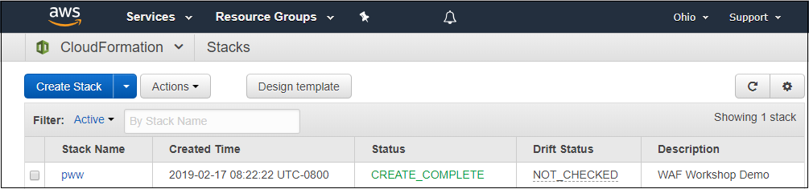

# Supercharging your Workload Defenses - Assess Phase

You have either just deployed a CloudFormation stack or AWS has done so on your behalf at an event.
The CloudFormation stack contains
a PHP website on Amazon EC2 instances behind an application load balancer.
You are now going to assess the posture of the site at both the host layer and at the network layer.

In this section you will do the following tasks:

1. Examine the stack that you built and its tags

2. Assess the host layer by installing an Amazon Inspector agent on the EC2 instances and running an Inspector scan to look for host layer vulnerabilities.

4. Assess the network layer by running an external network scan using a network scanner.

## Examine the stack that you built and its tags

1. Go to the CloudFormation console in the same AWS region in which you created the stack in the Build Phase.  You should see a list of stacks similar to the figure below.

    

    If the console looks different than this, you may be using a newer version of the console.  In that case, use the menu on the left and click **Previous console**.

    Locate the stack you created. In this documentation, the name of the stack is *pww*.  If AWS built the stack for you, it may be a much longer name that stars with "module" with a random string after that.   If the stack name ends with three trailing periods ("..."), then widen the Stack Name column so you can see the entire name of the stack.  Copy this stack name into a scratch file on your workstation in case you need it later.

2. Click the **check box** to the left of the stack name and then click the **Resources** tab below.  You will see a list of resources that were deployed by the stack as shown in the figure below.

    

    The *Type* column lists the type of the resouces.  Notice that you will not see any resources of type AWS::EC2::Instance.  The reason for this is that the CloudFormation stack did not deploy any.  The stack did, however, deploy an auto scaling group with a launch configuration that in turn launched the instances.  The auto scaling group itself has tags and was configured to propogate the same tags (attributes) to the instances it launches.

    In a production environment, you may have a large number of resources that spin up and spin down because the load balancer will add and remove capacity as needed..  Knowing that the tags will be the same can make it easier for you to manage the environment regardless of how many instances exist at any point in time because you can use tags to identify the resources rather than relying on values like Instance Ids which can change.. You will now learn how to look up the Amazon EC2 instances using tags.


3.  Go to the Amazon EC2 console, select **Instances** from the menu and look for instances having names that begins with the stack name followed by *-node*, *pww-node* in this example.  You should see three such instances.  If you cannot see them, type the instance name (*pww-node* in this case) into the search box.  Select one of them by checking the box to the left of the instance and then click on the *Tags* tab in the bottom section of the window.  You should see a table like that in the figure below.

    

4.  Notice that the instance has tags reflecting the CloudFormation stack name and stack id.  These tags were added because the auto scaling group propogated (copied) the tags from the auto scaling group to all instances that the auto scaling group creates.

    You have now learned about the tags that you can use to look up AWS resources. You will take advantage of this feature when you set up Amazon Inspector later in this phase.

## Assess the Host Layer

### Install the Inspector Agent on the Amazon EC2 instances

Now that you know how to identify the instances in the environment, you need to install the Amazon Inspector agent on them.  AWS Systems Manager provides a way for you to run commands across your Amazon EC2 instances.  The commands are defined in *documents*.  AWS provides a document that you will use to install the Amazon Inspector agent.  You will use tags to identify the instances on which to apply the document. 

1.  Go to the AWS Systems Manager console.

2.  Under the *Actions* menu on the left, click **Run Command**.  You will be taken to the AWS Systems Manager Run Command home screen.  Click the **Run a Command** button and the *Run a Command* screen will appear.

3.  In the *Command document* window, enter *AmazonInspector* (no space betwen the words) into the search box and press Enter.  You should see a document named *AmazonInspector-ManageAWSAgent* appear.  Click the radio button to the left of that document as shown in the figure below.

    

4.  Scroll further down until you can see the *Targets* window.  Click the **Specifying a tag** radio button.  For the tag key, enter *aws:cloudformation:stack-name*.  For the value enter the name of the CloudFormation stack you created (*pww* in this example) and click *Add*.  Your screen should be similar to the figure below.

    

5.  Scroll down to the *Output options* window.  Clear the box next to *Enable writing to an S3 bucket* as shown in the figure below.

    

6.  Scroll to the bottom of the screen and click the *Run* button.  You will then be be taken to the command status window while the installation of the Amazon Inspector is running.  You can periodically update the command status by clicking on the refresh button within the window.   After the commands finish running, the *Overall status* should be *Success* as shown in the figure below.  The number of instances may vary based on the version of the template.

    

    You have now installed the Amazon Inspector agent on the instances in the environment.

### Configure the Amazon Inspector target

1. Go to the Amazon Inspector console and click **Get Started** if prompted.  If you see a "Welcome to Amazon Inspector" wizard appear, click **Cancel**.  You will set up Amazon Inspector manually so you can become more familiar with the service.

2. Click **Assessment Targets** on the left menu and then click the **Create** button.

3. Scroll down to the Assessment Target window.  In the *Name* field, enter a name for the target.  For example, given that the stack name in this example is *pww*, you can enter **pww targets** or another name of your choosing.

4. In the *Use Tags* section, select **aws:cloudformation:stack-name** for the key from the drop down list and select the name of the stack (*pww* in this example) from the drop down value list.

5. Uncheck the *Install Agents* check box since we have already installed the agent. Your screen should look similar to the figure below.

    

6.  Click the **Save** button to save the target definition.  Inspector may prompt you for permission to create a service linked role to give the Amazon Inspector service permission to retrieve information about your instances.  If you see a prompt like the one in the figure below, click **Ok** to create the role.

    

    You have now created an Amazon Inspector target that identifies the instances that would be assessed.  The target selects instances based on tag values.  In this case, the tag you are using is *aws:cloudformation:stack-name* which is set to the name of the CloudFormation stack.  In particular, the tag is added to the auto scaling launch configuration which is configured to propagate the tag to the Amazon EC2 instances that it launches.  Because of this, Amazon Inspector will automatically scan new instances that may appear over the lifetime of the environment.  This is an example of how the elasticity of the AWS cloud when combined with tagging can enable you to support dynamic environments.

### Configure the Amazon Inspector template and run the assessment

Now that you have created an Amazon Inspector target, you will now create an Amazon Inspector tepmlate.  You use templates to define the Amazon Inspector targets and rule packages that comprise an assessment run.

1.  Go to the Amazon Inspector console, click **Assessment templates** on the menu, and then click **Create**.

2.  In the *Name* field, enter a name for the template.

3.  In the *Target name* field, select the target you previously created from the list of options.

4.  In the *Rules packages* field, select **Common Vulnerabilities and Exposures** and **Security Best Practices**.

5.   In the *Duration* field, select **15 minutes**.  Do **not** accept the default value!

6.  In the Assessment Schedule, uncheck (turn off) the *Set up recurring assessment* runs so that the assessment template will only run a one-time assessment.

7.  Scroll to the bottom and click the **Create and run** button to save the template and run the assessment.  Depending on the size of your screen, you may have to scroll down multiple windows.  If you cannot click **Create and run**, make sure you unchecked the box in the previous step and try again.  The assessment will start and will take 15 minutes to compete.

!!! info "If the scan fails to start..."
    If the scan fails to start, it may be because the Inspector agents have not finished registering with Inspector.   Wait a few minutes, delete the template, recreate it, and then retry the scan.

---

8.  On the Amazon Inspector menu, click **Assessment runs**.  You should see an entry for the assesment you just started.  While the assessment is running, the status will be *Collecting data*.  Periodically refresh the screen to see the current status.  When the assessment run ends, the status will change to *Analysis complete.*  The assessment will run for approximately 15 minutes. **_While you are waiting, continue with the steps below._**

## Assess the Network Layer

### Identify the Application Load Balancer and Connect to the RedTeam Host

1.  Go to the stack outputs and look for the website URL stored in the **albEndpoint** output value. Test access to the site by right clicking and opening in a new tab. Note the URL for your site as this will be used throughout this workshoop round.

2. While still in stack outputs, right click the link in **RedTeamHostSession** and open in new tab. This will launch an AWS Systems Manager Session Manager to the host you will use to perform add hock scans against your site URL.

!!! info "AWS Systems Manager Session Manager"
    Session Manager is a fully managed AWS Systems Manager capability that lets you manage your Amazon EC2 instances through an interactive one-click browser-based shell or through the AWS CLI. Session Manager provides secure and auditable instance management without the need to open inbound ports, maintain bastion hosts, or manage SSH keys. 

### Using the Scanner

In order to test your AWS WAF ruleset, this lab has been configured with two scanning capabilities; a Red Team Host where you can invoke manual scanning and an automated scanner which runs from outside your lab environment. 

The scanner performs 10 basic tests designed to help simulate and mitigate common web attack vectors. 

1. Canary GET - This should succeed and shows that the scanner is not being blocked.
2. Canary POST - This should succeed and shows that the scanner is not being blocked.
3. SQL Injection (SQLi) attack in Query String
4. SQL Injection (SQLi) attack in Cookie
5. Cross Site Scripting (XSS) attack in Query String
6. Cross Site Scripting (XSS) attack in Body

!!! info "Note about Tests"
    _These basic tests are designed to provide common examples you can use to test AWS WAF functionality. You should perform thorough analysis and testing when implementing rules into your production environments._

Once you have started a Session Manager connection to your Red Team Host, the scanner script can be invoked by typing the following command while in the _/usr/bin_ directory:

````
python3 scanner.py http://your-alb-endpoint
````


The scanner.py script will run each of the tests above and report back the following information:

- __Request__: The HTTP request command used.
- __Test Name__: The name of the test from list above.
- __Result__: The HTTP status code returned.

The logic in the scanner script color codes the response as follows:

- __Green__: 403 - Forbidden (_Except for canary GET and POST tests._)
- __Red__: 200 - OK
- __Blue__: 404 - Not Found
- __Yellow__: 500 - Internal Server Error

As you can see by running the script there are several vulnerabilities that need to be addressed. In the remnediate phase you will configure an AWS WAF Web ACL to block these requests. When AWS WAF blocks a web request based on the conditions that you specify, it returns HTTP status code 403 (Forbidden). For a full view of the request and response information, you can paste the **Request** command directly into the console and add the --debug argument.

!!! info "Note about Testing Tool"
    The scanner.py script uses an open source <a href="https://httpie.org/" target="_blank">HTTP client called httpie</a>. HTTPie—aitch-tee-tee-pie—is a command line HTTP client with an intuitive UI, JSON support, syntax highlighting, wget-like downloads, plugins, and more.

*This completes the Assess Phase.*

---

Click [here](remediate.md) to proceed to the Remediate Phase.
