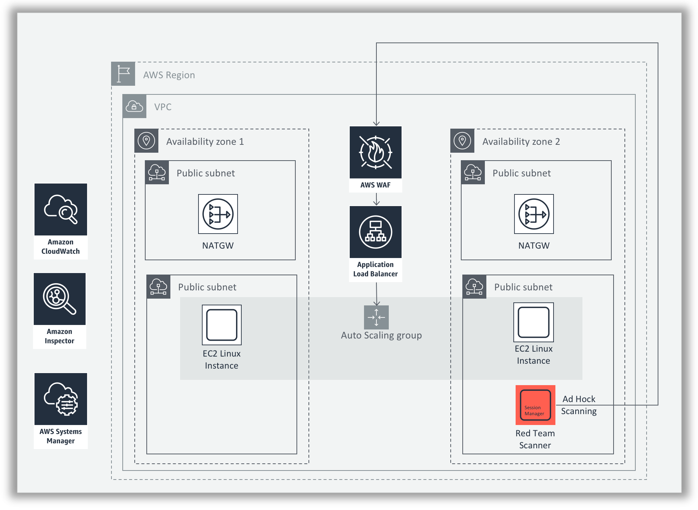

# Protecting workloads on AWS from the instance to the edge

Welcome to the AWS Supercharging your Workload Defenses Builder Session!

In this builder session, you will build an environment consisting of two Amazon Linux web servers behind an application load balancer. The web servers will be running a PHP web site that contains several vulnerabilities. You will then use AWS Web Application Firewall (WAF), Amazon Inspector and AWS Systems Manager to identify the vulnerabilities and remediate them. 

## Scenario

Welcome to Widgets LLC! You have just joined the team and your first task is to enhance security for the company website. The site runs on Linux, PHP and Apache and uses an EC2 an autoscaling group behind an Application Load Balancer (ALB). After an initial architecture assessment you have found multiple vulnerabilities and configuration issues. The dev team is swamped and will not be able to remediate code level issues for several weeks. Your mission in this workshop round is to build an effective set of controls that mitigate common attack vectors against web applications, and provide you with the monitoring capabilities needed to react to emerging threats when they occur.

* **Level**: Intermediate - Advanced
* **Duration**: 1 hour
* **CSF Functions**: Protect
* **CAF Components**: Preventive
* **Prerequisites**: AWS Account, Admin IAM User

## Builder Session Architecture

Here is a diagram of the architecture.  As mentioned above, the environment contains two Web servers running Apache on Linux behind and Application Load Balancer.  Feel free to refer to this diagram if you have questions throughout this exercise. 

---

Click [here](getting-started.md) to proceed to the Getting Started phase.
