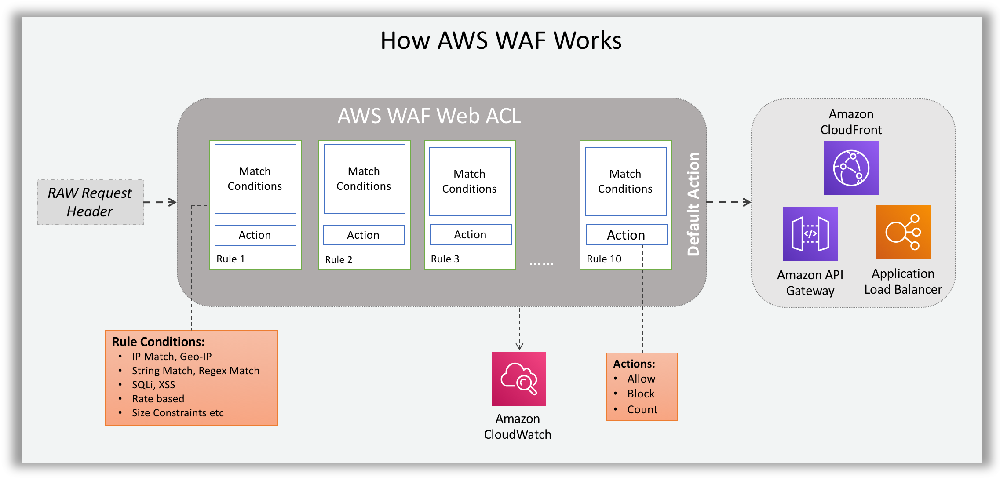
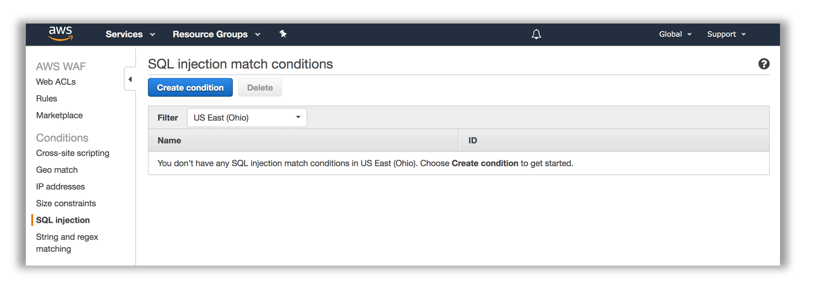
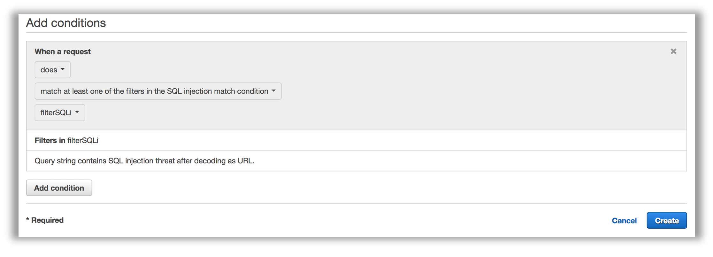
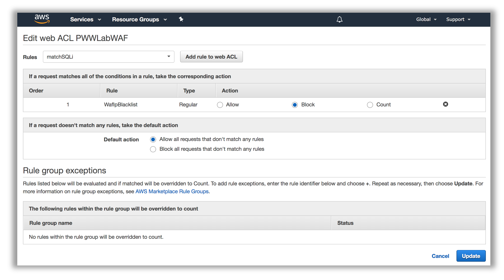

# Supercharging your Workload Defenses - Remediate Phase

In the previous phase, you ran a scan for host-layer vulnerabilities and identified several vulnerabilities in the network layer.
You are now going to remediate the findings. In this section you will do the following tasks:

1. Remediate the network findings by implementing WAF conditions and rules.
2. Remediate the host layer findings by applying patches to the host operating systems.

## Remediate the Network Layer Findings

### Identify the WAF ACL for your Site

1. If needed, go to <a href="https://console.aws.amazon.com/console/home" target="_blank">https://console.aws.amazon.com/console/home</a>. You will be redirected to the AWS Management Console dashboard on successful login:

Make sure you select the appropriate AWS Region when working in the AWS Management Console (top right corner, on the menu bar).

2. From the Management Console dashboard, navigate to the AWS WAF & Shield service console. You can do that several ways:
    - Type “WAF” in the AWS services panel search box and select the resulting option
    - Expand the Services drop down menu (top left on the menu bar) and choose WAF & Shield
    - Expand the All services area of the AWS services panel and choose WAF & Shield
Once selected, you will be redirected to the AWS WAF & AWS Shield service console. You may see an initial landing page at first. Choose *Go to AWS WAF*.

3. In the side bar menu on the left, pick the Web ACLs option under the AWS WAF heading. If the list of Web ACLs appears empty select the correct AWS Region as indicated on your credentials card in the Filter dropdown. If you are sharing the same account with other participants you can identify your WAF ACL by the Id in the stack outputs.

4. Click on the WAF Web ACL Name to select the existing Web ACL. Once the detail pane is loaded on the left of your screen, you will see three tabs: Requests, Rules, and Logging. Click on **Rules**.

You should be able to see a pre-existing rule configured to block requests and that your Web ACL is associated with an Application load balancer resource. Click on the rule name to look at the properties of the existing rule. You should see two entries in the associated IP address list for the loopback/localhost IP addresses (127.0.0.0/8, ::1/128).

### AWS WAF Rule Design and Considerations

#### Basics

AWS WAF rules consist of *conditions*. Conditions are lists of specific filters (patterns) that are matched against the HTTP request components processed by AWS WAF. The filters, including their attributes, are specific to the type of condition supported by AWS WAF. A condition, as a whole, is considered as _matched_, if any of the listed filters is matched.

Each condition attached to a rule is called a *predicate*. Predicates are evaluated using Boolean logic. A predicate is evaluated as matched or not matched (negated predicted), and multiple predicates are evaluated using Boolean AND – all predicates must match for the rule action to be triggered.

Web ACLs are ordered lists of rules. They are evaluated in order for each HTTP request and the action of the first matching rule is taken by the WAF engine, whether that is to allow, block or count the request. If no rule matches, the default action of the web ACL prevails.

!!! info "Note About Conditions and Rules"
    Conditions and rules are reusable resources within the region in which they are created.  You should consider the effects of changes to WAF conditions and rules in your organizations change control procedures.

!!! info "Note About This Section"
    **In order to illustrate the process of creating WAF conditions and rules, we will walk through the creation of the first rule in your WAF ACL.** The complete list of threats and solutions is available in the <a href="./#waf-rule-creation-and-solutions">WAF Rule Creation and Solutions</a> section.

####AWS WAF Concepts:

The following illustration shows AWS WAF Conditions, Rules and Web ACL's.

The following illustration shows how AWS WAF checks the rules and performs the actions based on those rules.

###Example Rule Design and Creation:

As an example, lets say we want to build a rule to detect and block SQL Injection in received in query strings. Let’s see how these questions help us plan the implementation of the rule. _This walkthrough will get you started with the ruleset required to mitigate the simulated threats in the workshop. It's purpose is to help you better understand the rule creation process. You will create the remaining rules from solution hints provided below._

####Sample Rule purpose:

- **Detect SQL Injection in query string, use ‘block’ action in Web ACL**

####HTTP request components:

- **Request Method** – form input typically gets submitted using a GET HTTP request method
- **Query String** – the SQL injection attempt is located in the query string 

####Define the purpose of the rule using Boolean logic:

- If **Query String contains suspected SQL Injection** then **block**

####Sample Rule - Conditions to implement:

- **SQL injection Match Condition** targeting the request **Query string**

####Relevant transformations:

- **SQL Injection Match Condition** query strinb is URL encoded, so we will apply the **URL_DECODE** transformation.

####Rules to implement:

- Rule with 1 predicate matching SQL injection condition

##Console Walkthrough - Creating a Condition and Rule

1. In the AWS WAF console, create a SQL injection condition by selecting **SQL injection** matching from the side-bar menu to the left of the console, under the **Conditions** heading.

2.	Click on **Create Condition**:

3.	Enter **filterSQLi** into the **Name** field and select the region where you deployed the stack. Add a filter (pattern) to the condition. Set the **Part of the request to filter on** to **Query string** and set the **Transformation** to **URL decode**. Click **Add filter** and then click **Create**.

4. With the condition created, and any additional conditions created based on need as well, you are ready to create a rule. In the AWS WAF console, select **Rules** from the side-bar menu to the left of the console, under the **AWS WAF** heading.

5\.	Click on **Create Rule**:

6.	Provide **matchSQLi** for the name, metric name and sect the region where you deployed the stack. Set the **rule type** to **Regular rule**.

7.	Add a condition to the rule. For our rule example, choose “When a request” **does** (no negation) **match at least one of the filters in the SQL injection match condition**. Choose the SQL injection condition you have previously created.

8.	Click **Add Condition** and click **Create** at the bottom of the screen.

9\. Follow the steps in the <a href="./#identify-the-waf-acl-for-your-site">Identify the WAF ACL for your site</a> section above to go back to the Rules tab of your web ACL.

10\.	Click **Edit web ACL**.

11\. In the **Rules** dropdown, select your rule, and click **Add rule to web ACL**.

12\. Reorder the rules as appropriate for your use case.

13\. Click **Update** to persist the changes.

14\. Create additional conditions for SQL injection mitigation:

??? info "Solution"
    1.	update the **SQL injection** condition named filterSQLi with 2 additional filters
        1. _query_string, url decode_ _You should have created this filter in <a href="./#console-walkthrough-creating-a-condition-and-rule">the walk through</a>_
        2. body, html decode
        3. header, cookie, url decode

15\. Now run the scanner that you used during the previous Assess phase. Did anything change? Why?

## Host Layer - Examine the Inspector findings and configure Patch Manager

### Examine the Inspector findings

1. After the assessment run has completed, go to the Amazon Inspector console and click **Assessment runs**.  The window should be similar to what appears below.

    

2. On the line that represents your most recent run, make note of the number in the *Findings* column (112 in this diagram).  After you perform the remediation later in this workshop, that number should decrease.   Click on the number in the *Findings* column.  The findings associated with the run will appear as shown below.

    

3.  You will see findings for each of the rules packages that you used in the assessment.  The number of findings often varies by the age of the AMI (Amazon Machine Image) because older AMIs typically have more vulnerabilities than newer AMIs.  Choose one of the findings associated with the Common Vulnerabilities and Exposures rule package.  An example appears below.

    

    Note that there is a link in the recommendation on which you can click to see the CVE entry.

4.  Now that you have run the assessment and seen the findings you are ready to perform some remediation.  You will use AWS Systems Manager to set up patching and then rerun the Inspector scan to see how patching affects the results.

### Use AWS Systems Manager Patch Manager

1. Go to the Systems Manager console and select Patch Manager.  If you see the Patch Manager home screen, then click the **View predefined patch baselines** link as shown below:

    

2.  You will now see a list of predefined patch baselines that are used to patch each operating system supported by Patch Manager.   The default patch baseline only patches major security issues.  You are going to crate a new Amazon Linux 2 patch baseline that will patch more things and make this new patch baseline the default.  Click **Create patch baseline**.

3.  In the *Name* field, enter a name to give the new baseline such as **mybaseline**.  In the *Operating system* field, select **Amazon Linux 2**.  In the *Approval rules* section, check the box under *Include non-security updates*.  IMPORTANT NOTE:  Depending on the size of the screen, the box may not align with the title *Include non-security updates*.  See the figure below.

    

4.  Click the **Create patch baseline** button at the bottom of the screen.  You should now see the new patch baseline in the list of baselines.  You may need to refresh the browser window to see it.  This new patch baseline includes non-security patches.  Note at the end of the line representing the newly created patch baseine you will see *No* in the *Default Baseline* column as shown in the figure below.

    

5. Click the radio button on the line with the newly created patch baseline.  From the *Actions* menu at the top select **Set default patch baseline**.  You will be asked to confirm this.  You have just set the default patch baseline for Amazon Linux 2 to use the patch baseline you just created that includes non-security patches.  You should now see *Yes* at the end of the patch baseline as shown below.

    

6. Click **Configure patching** In the *Configure patching* screen, go to the *Instances to patch* section and click the **Enter instance tags** radio button.  In the *Instance tags* field, enter *aws:cloudformation:stack-name* into the *Tag key* field.  In the *Tag value* field, enter the stack name that you created earlier.  Click **Add**.  **Important: If you are using copying & pasting into these fields, be careful to remove any trailing spaces or the instance lookups will not work!**

7. In the *Patching schedule* section, click the *Skip scheduling and patch instances now* radio button.

8. In the *Patching operation* section, click the *Scan and install* radio button if it is not alerady selected.  Your screen should look similar to the image below.

    

9.  Click the **Configure patching** button at the bottom of the window.  You will see a message at the top of your screen saying that *Patch Manager* will use *Run Command* to patch the instances.   *Run Command* is another feature of AWS Systems Manager that runs a command across multiple Amazon EC2 instances.  Patch Manager build the commands necessary to perform the patching and is using Run Command to actually execute the commands.

### Check the patching status

You are now going to examine the status of the patching operation by using AWS Systems Manager Run Command.

1. Go to the AWS Systems Manager Console and click **Run Command** on the left menu.  If the patching is still running, you will see the entry in the *Commands* tab.  Wait for the command to finish.  Refresh the screen if necessary to update the display.  Once the command has finished, click on **Command history**.

2. Look for the line containing the document name **AWS-RunPatchBaseline**.  That represents the Patch Manager activity.Your screen should look similar to the image below.

    

3.  Click on the **Command ID** link to see more details about the command.  You will see a line for each target with a link referencing the Instance ID.  If you then click on the **Instance ID**, you will see each step of the command that is executed.   Note that some steps are skipped because they do not apply to the operating system of the instance.  Also, you only see the first part of the command output.  If you want to see all of the output you can configure Systems Manager to direct the output into an Amazon S3 bucket.

    You have now completed the patching operation.  In the Verify Phase, you will re-assess the environment with Amazon Inspector.

### Launch Second Inspector Assessment Run

1.  Go to the Amazon Inspector console, click **Assessment templates** on the menu.

2.  Locate the template that you created during the Assess Phase and check the box at the left end of that row.

3.  Click **Run**.  This will launch another assessment run. 

4.  Click **Assessmnet runs** and periodically refresh the screen.  Wait until the status for the run changes to *Analysis complete*.  The run will take approximately 15 minutes to complete. **_While you are waiting, continue with the steps below._**

## Additional WAF Rule Creation

While you are waiting for the second scan to complete, let's do a few more WAF remediations.

Use Cross-site scripting, as well as string matching conditions to build rules that mitigate cross site scripting attacks.

1\. Create conditions andrule for Cross-site scripting mitigation:

??? info "Solution"
    1.	create **Cross-site scripting** condition named filterXSS with 4 filters
        1. query_string, url decode
        2. body, html decode
        3. body, url decode
        4. header, cookie, url decode
    2.	create a **String and regex matching** _String match_ type condition named filterXSSPathException with 1 filter. _This demonstrates how to add an expception for the XSS rule._
	    1. uri, starts with, no transform, _/reportBuilder/Editor.aspx_
    3.	create a rule named matchXSS
        1. type regular
        2. does match XSS condition: filterXSS
        3. does not match string match condition: filterXSSPathException
    4.	add rules to Web ACL
    5.  Re-run the WAF test script (scanner.py) from your red team host to confirm requests are blocked

*This completes the Remediate Phase.*

---

Click [here](verify.md) to proceed to the Verify Phase.
