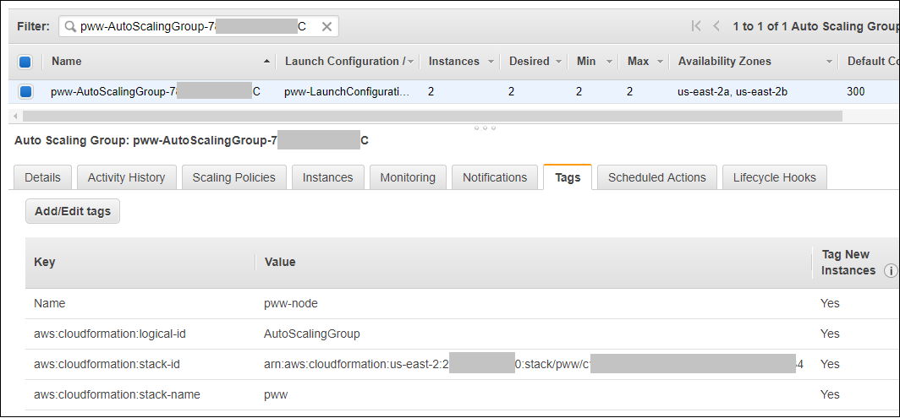

# Identifying and Remediating Host Vulnerabilities - Host Layer Round - Assess Phase

In the previous Build Phase, you deployed a CloudFormation stack that contains
some Amazon EC2 instances behind an application load balancer.
You are now going to use Amazon Inspector to assess the instances and identify
findings that need to be remediated.

Before you can assess the instances with Amazon Inspector, you need to identify
the instances and install the Amazon Inspector agent on them.
This is easier to do in small environments with only a few instances but can become more
difficult in organizations with hundreds or even thousands of instances.
For this reason, you are going to learn how to use *tags* to select the instances on which you will install the Amazon Inspector agent.
Tags are labels that can be attached to AWS resources to make it easier to
act on them collectively.

In this section you will do the following tasks:

1. Examine the CloudFormation stack you built to learn about the tags that were applied by AWS CloudFormation.
2. Use AWS Systems Manager to install the Amazon Inspector agent on the instances and run the scan
3. Learn about Amazon Inspector rules packages
4. Examine Amazon Inspector findings

## Examine the stack that you built and its tags

1. Go to the CloudFormation console in the same AWS region in which you created the stack in the Build Phase.  You should see a list of stacks similar to the figure below. Locate the stack you created.  In this documentation, the name of the stack is *pww*.  Copy this stack name into a scratch file on your workstation in case you need it later.

    

2. Click the **check box** to the left of the stack name and then click the **Resources** tab below.  You will see a list of resources that were deployed by the stack as shown in the figure below.

    

    The *Type* column lists the type of the resouces.  Notice that you will not see any resources of type AWS::EC2::Instance even though there are now EC2 instances running..  The reason for this is that the CloudFormation stack did not deploy any - at least not directly.  The stack did, however, deploy an auto scaling group with a launch configuration that in turn launched the instances.  You will now look at the auto scaling group and see how it supports tagging.

3.  Continue scrolling through the resources shown by CloudFormation and look for a resource named *AutoScalingGroup* as shown in the picture below.

    

    Click the hyperlink next to AutoScalingGroup.  This will take you to the Amazon EC2 console and display the auto scaling group.  Click on the *Tags* tab to see how the auto scaling group handles tags.  Your console display should look similar to the picture below.

    

    The picture above shows that there are four tags that are propogated to every EC2 instance created by the auto scaling group.  The tags include a *Name* tag and three additional tags that are generated by CloudFormation.  This tells us that every EC2instance that is launched by the auto scaling group will have a Name tag with the value of *pww-node*.

    In a production environment, you may have a large number of resources that spin up and spin down because of the elastiicity that AWS offers.  If you understand how tags are applied you can more easily manage the environment regardless of how many instances exist at any point in time. You will now learn how to look up the Amazon EC2 instances using tags.

4.  Go to the Amazon EC2 console and look for instances having a name that begins with the stack name followed by *-node*, *pww-node* in this example.  If you cannot see them, type the instance name (*pww-node* in this case) into the search box.  Select one of them by checking the box to the left of the instance and then click on the *Tags* tab.  You should see a table like that in the figure below.

    

5.  Notice that the instance has tags reflecting the CloudFormation stack name and stack id.  These tags are added because of settings in the auto scaling group which propogate tags to newly created instances.

    You have now learned about the tags that you can use to look up AWS resources. You will take advantage of this feature when you set up Amazon Inspector later in this phase.

## Install the Inspector Agent on the Amazon EC2 instances

Now that you know how to identify the instances in the environment, you need to install the Amazon Inspector agent on them.  AWS Systems Manager provides a way for you to run commands across your Amazon EC2 instances.  The commands are defined in *documents*.  AWS provides a document that you will use to install the Amazon Inspector agent.  You will use tags to identify the instances on which to apply the document. 

1.  Go to the AWS Systems Manager console.

2.  Under the *Actions* menu on the left, click **Run Command**.  You will be taken to the AWS Systems Manager Run Command home screen.  Click the **Run a Command** button and the *Run a Command* screen will appear.

3.  In the *Command document* window, page through the available documents until you find the document named *AmazonInspector-ManageAWSAgent*.  Click the radio button to the left of that document as shown in the figure below.

    

4.  Scroll further down until you can see the *Targets* window.  Click the **Specifying a tag** radio button.  For the tag key, enter *aws:cloudformation:stack-name*.  For the value enter the name of the CloudFormation stack you created (*pww* in this example) and click *Add*.  Your screen should be similar to the figure below.

    

5.  Scroll down to the *Output options* window.  Clear the box next to *Enable writing to an S3 bucket* as shown in the figure below.

    

6.  Scroll to the bottom of the screen and click the *Run* button.  You will then be be taken to the command status window while the installation of the Amazon Inspector is running.  You can periodically update the command status by clicking on the refresh button within the window.   After the commands finish running, the *Overall status* should be *Success* as shown in the figure below.  The number of instances may vary based on the version of the template.

    

    You have now installed the Amazon Inspector agent on the instances in the environment.

## Use Amazon Inspector to scan the instances

### Configure the Amazon Inspector target

1. Go to the Amazon Inspector console and click **Get Started** if prompted.  If you see a "Welcome to Amazon Inspector" wizard appear, click **Cancel**.  You will set up Amazon Inspector manually so you can become more familiar with the service.

2. Click **Assessment Targets** on the left menu and then click the **Create** button.

3. Scroll down to the Assessment Target window.  In the *Name* field, enter a name for the target.  For example, given that the stack name in this example is *pww*, you can enter **pww targets** or another name of your choosing.

4. In the *Use Tags* section, select **aws:cloudformation:stack-name** for the key from the drop down list and select the name of the stack (*pww* in this example) from the drop down value list.

5. Uncheck the *Install Agents* check box since we have already installed the agent. Your screen should look similar to the figure below.

    

6.  Click the **Save** button to save the target definition.  Inspector may prompt you for permission to create a service linked role to give the Amazon Inspector service permission to retrieve information about your instances.  If you see a prompt like the one in the figure below, click **Ok** to create the role.

    

    You have now created an Amazon Inspector target that identifies the instances that would be assessed.  The target selects instances based on tag values.  In this case, the tag you are using is *aws:cloudformation:stack-name* which is set to the name of the CloudFormation stack.  In particular, the tag is added to the auto scaling launch configuration which is configured to propogate the tag to the Amazon EC2 instances that it launches.  Because of this, Amazon Inspector will automatically scan new instances that may appear over the lifetime of the environment.  This is an example of how the elasticity of the AWS cloud when combined with tagging can enable you to support dynamic environments.

### Configure the Amazon Inspector template and run the assessment

Now that you have created an Amazon Inspector target, you will now create an Amazon Inspector tepmlate.  You use templates to define the Amazon Inspector targets and rule packages that comprise an assessment run.

1.  Go to the Amazon Inspector console, click **Assessment templates** on the menu, and then click **Create**.

2.  In the *Name* field, enter a name for the template.

3.  In the *Target name* field, select the target you previously created from the list of options.

4.  In the *Rules packages* field, select **Common Vulnerabilities and Exposures** and **Security Best Practices**.

5.   In the *Duration* field, select **15 minutes**.  Do **not** accept the default value!

6.  In the Assessment Schedule, uncheck (turn off) the *Set up recurring assessment* runs so that the assessment template will only run a one-time assessment.

7.  Scroll to the bottom and click the **Create and run** button to save the template and run the assessment.  Depending on the size of your screen, you may have to scroll down multiple windows.  If you cannot click **Create and run**, make sure you unchecked the box in the previous step and try again.  The assessment will start and will take 15 minutes to compete.

8.  On the Amazon Inspector menu, click **Assessment runs**.  You should see an entry for the assesment you just started.  While the assessment is running, the status will be *Collecting data*.  Periodically refresh the screen to see the current status.  When the assessment run ends, the status will change to *Analysis complete.*  The assessment will run for approximately 15 minutes.   While you are waiting, continue with the steps below.

### Learn more about Amazon Inspector Rules Packages

1.  Amazon Inspector offers a variety of rules packages that can be included in assessments.  The applicable rules packages may vary by operating system.   The Common Vulnerabilities and Exposures assessment is based on the CVE project that is hosted at [cve.mitrei.org](https://cve.mitre.org).  Open a new tab in your browser to [cve.mitre.orf](https://cve.mitre.org).  Click on **Search CVE List**.  Enter **CVE-2018-20169** into the search field and click **Submit**.  This shows you how to research known vulnerabilities.

2.  The Security Best Practices rule package examines some common configuration settings for some of the most commobn Amazon Linux settings.   You can read more about this rule package [here](https://docs.aws.amazon.com/inspector/latest/userguide/inspector_security-best-practices.html).

### Examine the findings

1. After the assessment run has completed, go to the Amazon Inspector console and click **Assessment runs**.  The window should be similar to what appears below.

    

2. On the line that represents your most recent run, make note of the number in the *Findings* column (22 in this diagram).  After you perform the remediation later in this workshop, that number should decrease.   Click on the number in the *Findings* column.  The findings associated with the run will appear as shown below.

    

3.  You will see findings for each of the rules packages that you used in the assessment.  The number of findings often varies by the age of the AMI (Amazon Machine Image) because older AMIs typically have more vulnerabilities than newer AMIs.  Choose one of the findings associated with the Common Vulnerabilities and Exposures rule package.  An example appears below.

    

    Note that there is a link in the recommendation on which you can click to see the CVE entry.

4.  Now that you have run the assessment and seen the findings you are ready to perform some remediation.

    Click [here](./remediate.md) to proceed to the Remediate Phase.

